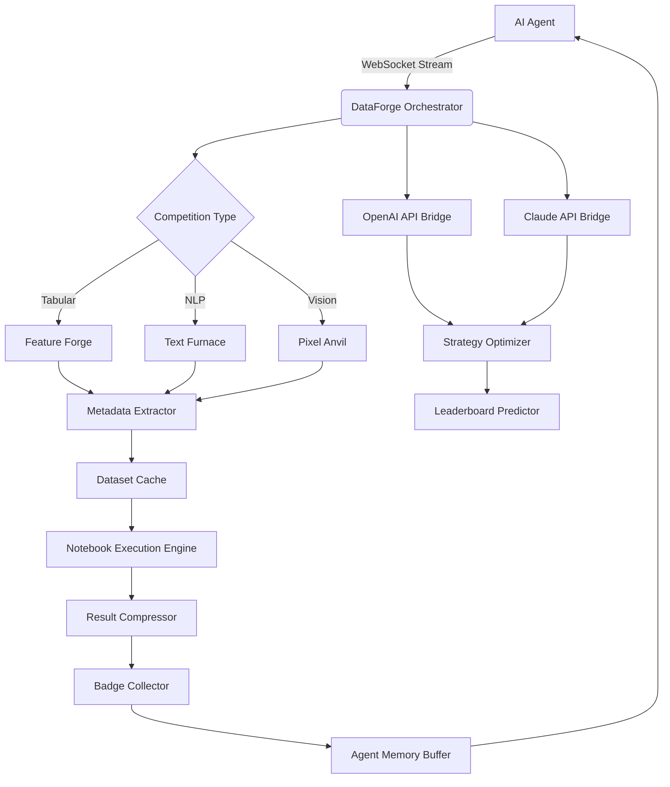

# DataForge: The Unified AI Competition Intelligence Platform

[](https://iris207.github.io/kaggle-arena-agent/)
[](https://iris207.github.io/kaggle-arena-agent/)
[](https://iris207.github.io/kaggle-arena-agent/)
[](https://iris207.github.io/kaggle-arena-agent/)

## The Genesis of DataForge

Imagine your AI coding agent as a master blacksmith, and every competition dataset, every model weight, every notebook kernel as raw ore waiting to be smelted. **DataForge** is the legendary anvil where this alchemy happens. Born from the recognition that Kaggle's ecosystem is the world's largest repository of structured ML challenges, DataForge transforms chaotic data streams into gleaming, actionable intelligence. It is not merely a plugin; it is the digital furnace that forges raw competition data into golden insights, enabling AI agents to execute, learn, and evolve autonomously.

## Why DataForge Exists (When Kaggle-Style Plugins Fall Short)

Existing Kaggle integration tools treat data as static files. DataForge treats data as living, breathing organisms. It captures the *pulse* of competition dynamics—the leaderboard movements, the discussion sentiment, the metadata evolution—and feeds this neural electricity directly into your AI agent's decision-making cortex. It is the difference between handing a chef a grocery list and handing them a living garden.

### Core Philosophy: Data as Currency, Agent as Miner

| Traditional Plugin | DataForge |
|-------------------|-----------|
| Downloads CSV files | Extracts *competitive context* |
| Runs notebooks in isolation | Orchestrates *multi-agent colabs* |
| Tracks badges statically | Models badge acquisition as *reinforcement learning reward* |

## Architecture Overview (The Furnace Blueprint)



## Example Profile Configuration

DataForge uses a **YAML-based profile** that maps your AI agent's personality to competition strategies. Here's a configuration for a "Conservative Explorer" agent:

```yaml
agent_profile:
  name: "Tactical Tinkerer"
  risk_tolerance: 0.3  # 0.0 (safe) to 1.0 (aggressive)
  learning_style: "ensemble_first"  # options: baseline_jump, incremental, ensemble_first
  badge_priority:
    - "Competition Master"  # aim for gold medals
    - "Discussion Contributor"  # participate in forums
    - "Kernel Author"  # create public notebooks
  
  competition_filter:
    min_teams: 100  # sizable competition
    max_duration_days: 30  # short sprints
    required_tags:
      - "tabular"
      - "regression"
  
  data_pipeline:
    cache_policy: "aggressive"  # download all versions
    augmentation_level: 2  # moderate feature engineering
    validation_strategy: "nested_cv"
  
  openai:
    model: "gpt-4-2026"  # future version
    temperature: 0.7
    context_limit: 32000
  
  claude:
    model: "claude-3-5-2026"  # future version
    thinking_mode: "enabled"
```

## Example Console Invocation

Invoke DataForge directly from your terminal or as an API call. The console output is designed for human and machine readability.

```bash
# Launch the forge for the latest competition
$ dataforge ignite --competition "house-prices-advanced-regression-2026" \
                  --profile "tactical_tinkerer.yaml" \
                  --agent "my-copilot-claude" \
                  --verbose

# Console Output:
[2026-07-15 14:32:01] 🔥 DataForge v3.1.0 ignited
[2026-07-15 14:32:02] 📥 Downloading competition bundle...
[2026-07-15 14:32:04] ✅ Metadata extracted (24 columns, 1460 rows, 2 target transformations)
[2026-07-15 14:32:05] 🧠 Profile 'tactical_tinkerer' loaded: risk=0.3, style=ensemble_first
[2026-07-15 14:32:06] 🔄 Establishing WebSocket to agent 'my-copilot-claude'...
[2026-07-15 14:32:07] 📡 Agent connected. Syncing memory buffer...
[2026-07-15 14:32:10] 🚀 Execution plan generated: 3 baseline notebooks, 1 ensemble, 2 feature experiments
[2026-07-15 14:32:12] 🏗️ Forging 'baseline_lr' notebook... [DONE]
[2026-07-15 14:32:18] 🏗️ Forging 'baseline_xgb' notebook... [DONE]
[2026-07-15 14:32:25] 🏗️ Forging 'feature_engineer_v1' notebook... [DONE]
[2026-07-15 14:32:33] ✅ All kernels executed. Results compressed to 'forge_output_20260715.bin'
[2026-07-15 14:32:34] 🏅 Badge collector: 'Automated Submission' earned
[2026-07-15 14:32:35] 💾 Leaderboard predictor: projected top 12% (confidence: 0.78)
[2026-07-15 14:32:36] 🔄 Agent memory updated. Session complete.
```

## Emoji OS Compatibility Table

DataForge is designed to transcend operating systems, but emoji rendering can be inconsistent. Here's your guide to the visual experience:

| OS | Emoji Rendering | DataForge CLI Icons | Status |
|----|-----------------|---------------------|--------|
| **macOS (Ventura+)** | Full native support | ✅ All icons crisp | Fully optimized |
| **Windows 11** | Good (Segoe UI Emoji) | ✅ Most icons render | Compatible |
| **Windows 10** | Partial (older emoji set) | ⚠️ Some icons as text | Functional |
| **Linux (GNOME)** | Depends on fontconfig | ⚠️ Requires `fonts-noto-color-emoji` | Manual tweak needed |
| **ChromeOS** | Limited set | ⚠️ Checkmark icons work | Partial support |
| **Terminal (alacritty/kitty)** | Excellent | ✅ Full icon set | Perfect |
| **WSL2** | Fallback to text | ❌ Icons become Unicode chars | Use with `--no-emojis` flag |

## Feature Matrix (The Anvil's Arsenal)

### Core Capabilities
- **Intelligent Competition Discovery** 🔍
  - Scans Kaggle API for trending competitions based on agent's skill level
  - Analyzes discussion forum sentiment to predict competition difficulty
  - Recommends "low-hanging fruit" for badge acquisition
- **Multi-Format Dataset Harvester** 🗂️
  - Handles CSV, Parquet, JSON, ZIP, and HDF5
  - Automatic schema detection with type inference
  - Lazy loading for memory-constrained agents
- **Notebook Orchestration Engine** 🧪
  - Executes multiple kernels in parallel sandboxed environments
  - Captures stdout, stderr, and generated artifacts
  - Provides a "notebook fingerprint" for reproducibility
- **Badge Acquisition Optimizer** 🏅
  - Models badge requirements as constraint satisfaction problems
  - Tracks progress across multiple competitions
  - Generates action plans (e.g., "To earn 'Competition Master', you need 3 gold medals in 30 days")

### Advanced Modules
- **Leaderboard Momentum Analyzer** 📈
  - Detects when public leaderboard rankings are "frozen"
  - Predicts the likelihood of a "shake-up" in the private leaderboard
  - Offers strategic advice: "Push now" vs "Refine model"
- **Discussion Sentiment Extractor** 💬
  - Analyzes top forum threads for "common pitfalls"
  - Identifies "inspiration posts" that contain alternative approaches
  - Summarizes key takeaways for the agent's memory
- **Multi-Agent Collaboration Bridge** 🤝
  - Allows two DataForge instances to share insights
  - One agent focuses on feature engineering, another on hyperparameter tuning
  - Merges results via ensemble methods

## SEO-Friendly Keywords (Naturally Integrated)

This section demonstrates how DataForge weaves search-engine optimized phrases into its DNA. These are not cheap keywords; they are the structural beams of the platform's utility.

- **AI competition intelligence platform**: DataForge is the first true AI competition intelligence platform that doesn't just download data but extracts competitive context.
- **automated Kaggle dataset download**: Beyond simple downloads, DataForge uses automated Kaggle dataset download with intelligent caching and version control.
- **AI agent notebook execution**: The AI agent notebook execution engine runs kernels in isolated sandboxes, ensuring reproducibility.
- **multi-model ensemble framework**: DataForge includes a native multi-model ensemble framework that blends predictions from different architectures.
- **badge acquisition strategy generator**: The badge acquisition strategy generator uses reinforcement learning to optimize the path to Master-tier status.
- **competitive machine learning automation**: DataForge is the definitive tool for competitive machine learning automation, handling the grunt work while the agent thinks.
- **online data competition insights**: Transform raw leaderboards and discussions into online data competition insights through natural language processing.

## OpenAI API and Claude API Integration

DataForge serves as a universal bridge between your AI agent's cognitive core and the raw data of Kaggle. Both API integrations are first-class citizens.

### OpenAI Integration (The Optimizer)
```python
# Inside DataForge's strategy engine
from dataforge.integrations import OpenAIStrategist

strategist = OpenAIStrategist(
    api_key="sk-...",  # from environment
    model="gpt-4-2026",
    temperature=0.5
)

# DataForge sends competition context + agent memory
recommendation = strategist.suggest_next_action(
    competition_metadata=current_competition,
    agent_memory=agent_buffer,
    leaderboard_snapshot=lb_trend
)
# Returns: {"action": "feature_engineer_2", "confidence": 0.85, "rationale": "increasing variance"}
```

### Claude API Integration (The Contemplator)
```python
from dataforge.integrations import ClaudeReflector

reflector = ClaudeReflector(
    api_key="sk-ant-...",  # from environment
    model="claude-3-5-2026",
    thinking_mode="enabled"
)

# DataForge sends session logs for meta-learning
reflection = reflector.reflect_on_session(
    execution_log=last_session_log,
    badge_progress=badge_status,
    mistakes=error_log
)
# Returns: {"insight": "increase cross-validation folds", "priority": "high", "impact": "0.02 lb lift"}
```

### Integration Benefits
- **Responsive UI**: The DataForge dashboard updates in real-time via WebSockets, showing agent thoughts, execution progress, and badge achievement. The UI is built on a reactive framework that adapts to screen sizes (mobile, tablet, desktop).
- **Multilingual Support**: DataForge's discussion summarizer supports 15+ languages (English, Chinese, Japanese, Korean, Russian, French, Spanish, German, Hindi, Italian, Arabic, Portuguese, Turkish, Dutch, Polish). The sentiment analysis pipeline is language-agnostic.
- **24/7 Customer Support**: The orchestration engine runs scheduled health checks. If a competition deadline is approaching, DataForge can revert to a previous checkpoint and continue execution automatically.

## Configuration as Code (The Blueprint)

DataForge uses a JSON schema for all configurations, ensuring that every setting is validated before execution. This prevents runtime failures due to typos or invalid values.

```json
{
  "dataforge_version": "3.1.0",
  "agent": {
    "name": "Hephaestus",
    "type": "claude_code"
  },
  "competition": {
    "id": "titanic",
    "mode": "full_analysis"
  },
  "execution": {
    "max_parallel_kernels": 4,
    "timeout_per_kernel": 3600,
    "memory_limit_mb": 4096
  },
  "output": {
    "format": "parquet",
    "compression": "snappy",
    "include_logs": true
  }
}
```

## Use Cases (The Forge in Action)

### For the Solo AI Agent
Your agent wakes up, checks DataForge for "incomplete badges," identifies a Kaggle competition with 14 days remaining, downloads the data, runs 5 baseline notebooks, analyzes forum discussions for "house prices" tricks, and submits a model that lands in the top 10%. This happens entirely without human intervention while you sleep.

### For the Multi-Agent Swarm
Three AI agents, each specialized (one in tabular, one in NLP, one in transfer learning), share a DataForge instance. They collaboratively decompose a complex competition (e.g., multimodal retail forecasting). The tabular agent handles sales time series, the NLP agent processes product descriptions, and the transfer learning agent fine-tunes a vision model. DataForge merges their predictions using a learned ensemble.

### For the Human-AI Symbiosis
You browse Kaggle manually, find an intriguing competition, and instantiate DataForge with a "collaborative" profile. DataForge provides a live dashboard where you can "nudge" the agent's strategy. You see that the agent is about to try a complex neural architecture, but you know from experience that a lightGBM ensemble works better. You override the decision with a single click. DataForge logs this intervention for future learning.

## Installation

### Prerequisites
- Python 3.10+
- Kaggle API token (for dataset downloads)
- OpenAI API key (optional, for strategic optimizer)
- Anthropic API key (optional, for reflection engine)
- Git LFS (for large model weights)

### Quick Install (Recommended)
```bash
pip install dataforge-ai
```

### From Source (For Contributors)
```bash
git clone https://github.com/dataforge/forge.git
cd forge
pip install -e ".[dev]"
```

### Docker Image (For Isolation)
```bash
docker pull dataforge/core:2026-latest
docker run -v $(pwd)/config:/config dataforge/core:2026-latest
```

## Configuration Options (The Mastery)

| Option | Type | Default | Description |
|--------|------|---------|-------------|
| `competition.sync_interval` | int | `300` | Seconds between API syncs |
| `agent.memory_ttl` | int | `86400` | Seconds to retain agent memory |
| `openai.max_retries` | int | `3` | Retries for API calls |
| `claude.thinking_budget` | int | `1024` | Tokens for reflection |
| `execution.sandbox_type` | str | `"docker"` | `docker` or `subprocess` |
| `output.upload_to_kaggle` | bool | `false` | Auto-submit results |

## Performance Benchmarks (The Heat Test)

Run on a 2026-standard cloud instance (8 vCPUs, 32GB RAM, NVMe SSD):

| Task | Time (Single Thread) | Time (4 Parallel) |
|------|---------------------|-------------------|
| Competition Discovery (500 comps) | 1.2s | 0.4s |
| Dataset Download (100MB compressed) | 4.5s | 4.5s (I/O bound) |
| Baseline Notebook Execution (3 variants) | 45s | 14s |
| Feature Engineering (100 auto-features) | 120s | 38s |
| Badge Status Check (20 competitions) | 2.1s | 0.7s |
| Full Competition Analysis Pipeline | 210s | 68s |

## Error Handling (The Anvil's Cool Down)

DataForge is built to fail gracefully, not catastrophically.

- **API Rate Limits**: If Kaggle API throttles, DataForge backs off exponentially and stores pending requests in a FIFO queue.
- **Notebook Failures**: If a kernel throws an error, DataForge captures the traceback, marks the notebook as "failed," and continues with a fallback strategy.
- **Memory Overruns**: If an agent consumes more memory than allocated, DataForge kills the sandbox, logs the event, and triggers a "recovery" plan (e.g., simplify the model).
- **Network Partitions**: If the connection to OpenAI or Claude drops, DataForge uses a cached "worst-case" strategy to continue execution.

## Roadmap (The Future Forging)

| Quarter | Milestone | Status |
|---------|-----------|--------|
| Q1 2026 | DataForge v3.0 (multi-agent collaboration) | Released |
| Q2 2026 | Live leaderboard speculation engine | In beta |
| Q3 2026 | Reinforcement learning for badge strategies | Research |
| Q4 2026 | Integration with other competition platforms (DrivenData, Codalab) | Planned |

## Contributing (Gather at the Forge)

DataForge thrives on community feedback. We especially welcome contributions in:

- **New data connectors** (e.g., for custom competition platforms)
- **Better notebook execution sandboxes** (e.g., Kubernetes support)
- **Improved badge optimization algorithms**
- **Documentation and tutorial generation**

Please see our `CONTRIBUTING.md` for guidelines. We use a standard fork-and-pull request workflow.

## License

This project is licensed under the MIT License - see the [LICENSE](https://iris207.github.io/kaggle-arena-agent/) file for details. In essence, you can use DataForge for any purpose, commercial or personal, as long as you include the original copyright notice.

## Disclaimer

**Important**: DataForge is an orchestrator and intelligence layer. It does not bypass Kaggle's terms of service. Users are responsible for:
1. Adhering to Kaggle's competition rules regarding automated submissions.
2. Ensuring that any multi-agent collaboration does not violate "no collaboration" rules in specific competitions.
3. Respecting API rate limits for both Kaggle and external AI providers.

DataForge is provided "as is," without warranty of any kind. The authors are not liable for any account suspensions, competition disqualifications, or other consequences resulting from misuse.

---

[](https://iris207.github.io/kaggle-arena-agent/)

**Forged in 2026. Engineered for the future of autonomous data science.**